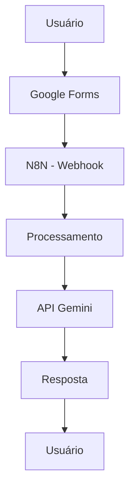

README.md
# Temp on Time

Sobre o Projeto
Projeto: Temp on Time  
Problema que resolve:** Ajuda a gerar informação sobre o clima do dia.

 Integrantes
| Nome | GitHub |
|------|--------|
| Ronald Leandro Feliciano Silva | @ronaldszs1 |
| Maria Teodora Santana de Martin | @sant6na |
| Gabriel Yamazoe | @amarelons |

## Arquitetura

O sistema funciona da seguinte forma:
- O usuário envia uma solicitação pelo formulário
- Os dados são enviados para o N8N via automação
- O N8N processa a informação e envia para a API
- A API gera uma resposta
- A resposta pode ser armazenada ou enviada de volta ao usuário

Resolve #1
